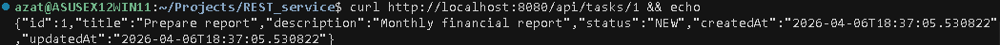
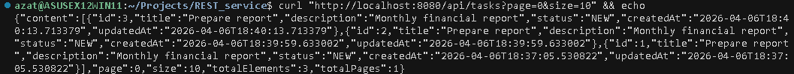
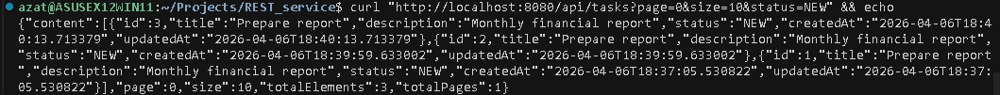
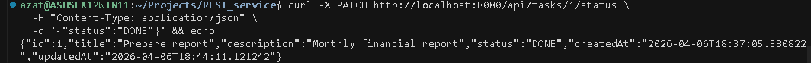
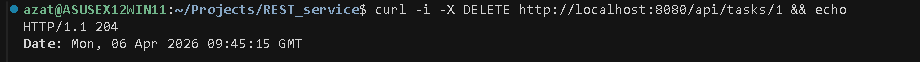
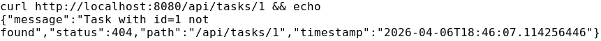

# Сервис каталога задач

REST API для управления задачами: CRUD-операции, пагинация, фильтрация, централизованная обработка ошибок. Реализовано на Kotlin + Spring Boot с использованием `JdbcClient` и реактивных типов в сервисном слое.

## Технологии
- Kotlin 2.3
- Spring Boot 3.5 (MVC)
- Reactor (`Mono` в сервисе)
- JdbcClient + нативный SQL
- Flyway + H2
- MockMvc / MockK / JUnit 5

## Архитектура
- Repository-слой синхронный, построен на `JdbcClient` и SQL.
- Сервисный слой возвращает `Mono` и выполняет блокирующие вызовы на `Schedulers.boundedElastic()`.
- Контроллеры — Spring MVC, но возвращают реактивные типы.
- Ошибки отдаются централизованно через `@RestControllerAdvice`.

## Архитектурные решения
- Требование использовать JDBC ⇒ `JdbcClient` + SQL без ORM.
- Чтобы оставить реактивный API, каждый блокирующий вызов оборачивается в `Mono.fromCallable { ... }` и переносится на `Schedulers.boundedElastic()`.
- Полностью реактивный стек не использовался, так как persistence всё равно блокирующий.

## Запуск
```bash
./gradlew bootRun
```
Сервис стартует на `http://localhost:8080`, база — H2 в памяти (`MODE=PostgreSQL`). Flyway применяет миграции автоматически.

### Тесты
```bash
./gradlew test
```

## Эндпоинты
- `POST /api/tasks` — создание задачи
- `GET /api/tasks?page={page}&size={size}&status={status?}` — список с пагинацией и фильтром
- `GET /api/tasks/{id}` — получение задачи
- `PATCH /api/tasks/{id}/status` — изменение статуса
- `DELETE /api/tasks/{id}` — удаление

## Примеры DTO
**Создание**
```json
{
  "title": "Prepare report",
  "description": "Monthly financial report"
}
```

**Обновление статуса**
```json
{
  "status": "DONE"
}
```

## Ручная проверка (curl)

### Создание задачи
```bash
curl -X POST http://localhost:8080/api/tasks \
  -H "Content-Type: application/json" \
  -d '{"title":"Prepare report","description":"Monthly financial report"}' && echo
```


### Получение по идентификатору
```bash
curl http://localhost:8080/api/tasks/1 && echo
```


### Список задач
```bash
curl "http://localhost:8080/api/tasks?page=0&size=10" && echo
```


### Фильтр по статусу
```bash
curl "http://localhost:8080/api/tasks?page=0&size=10&status=NEW" && echo
```


### Обновление статуса
```bash
curl -X PATCH http://localhost:8080/api/tasks/1/status \
  -H "Content-Type: application/json" \
  -d '{"status":"DONE"}' && echo
```


### Удаление задачи
```bash
curl -i -X DELETE http://localhost:8080/api/tasks/1 && echo
```


### Ошибка 404 после удаления
```bash
curl http://localhost:8080/api/tasks/1 && echo
```


## Пример ответа с ошибкой
```json
{
  "message": "Task with id=1 not found",
  "status": 404,
  "path": "/api/tasks/1",
  "timestamp": "2026-04-06T18:01:05"
}
```

## Ограничения входных данных
- `title`: от 3 до 100 символов, не пустая строка
- `page`: целое число ≥ 0
- `size`: целое число от 1 до 100
- `status`: одно из `NEW`, `IN_PROGRESS`, `DONE`, `CANCELLED`
